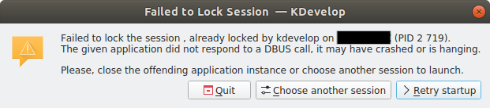

While choosing an existing session I was warned with message box:  

  

The problem was apparently in the incorrect completion of the required session.  
Look at `~/.local/share/kdevelop/sessions`. There must be subdirectories with names like below:  
`{05b438e8-7184-4d92-8fd1-7c6207a7b54b}`  
`{50b98a99-4b4a-4ae2-8de9-94cc81d27597}`  
`...`  
Each directory contains session data. And the required directory also contained file named `lock`.  
But deleting this file did not solve the problem.  
So I had to remove the entire subdirectory.  
And then recreated session using already existing Kdevelop projects (`*.kdev4`)
